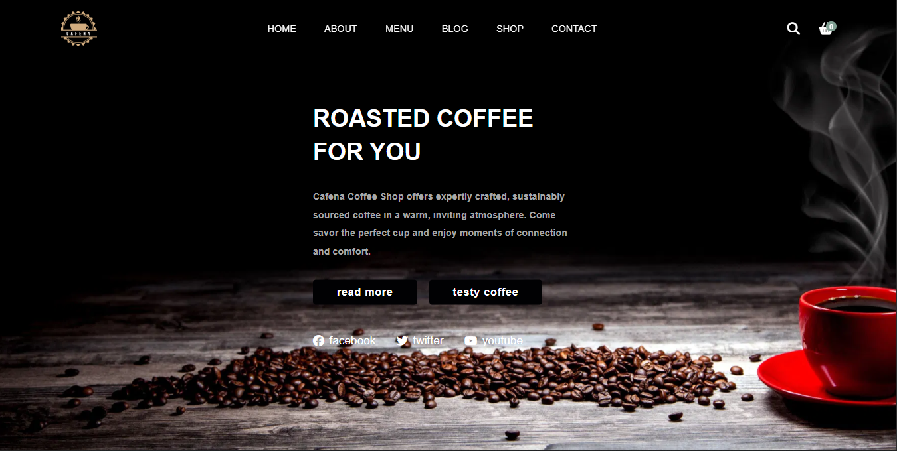

# ☕ Cafena Coffee Shop Website

Welcome to the official repository of **Cafena Coffee Shop** – a modern, responsive coffee website designed to provide customers a seamless digital café experience. From menu browsing to blog articles and shop interactions, Cafena brings a cozy café ambiance to the web.



---

## 📑 Table of Contents

- [📌 Overview](#-overview)
- [🧩 Features](#-features)
- [💡 Technologies Used](#-technologies-used)
- [📂 Project Structure](#-project-structure)
- [🎯 How to Use](#-how-to-use)
- [📸 Website Preview](#-website-preview)
- [📬 Contact](#-contact)
- [©️ License](#️-license)

---

## 📌 Overview

**Cafena Coffee Shop** is a front-end responsive website that showcases a fictional coffee brand, complete with:

- Interactive sections for home, about, menu, blog, shop, and contact.
- Scroll animations using AOS (Animate On Scroll).
- Responsive navigation and cart system.
- Beautiful imagery and branded content.

---

## 🧩 Features

| Section        | Description                                                                 |
|----------------|-----------------------------------------------------------------------------|
| **Home**       | Eye-catching hero section with call-to-action buttons and social icons.     |
| **About Us**   | Introduction to the coffee shop and its mission.                            |
| **Menu**       | Grid of featured coffee items with prices.                                  |
| **Shop**       | Product cards with discounts, ratings, and interactive icons.               |
| **Blog**       | Coffee-related news and articles.                                           |
| **Contact**    | Google Map embed and reservation-style contact form.                        |
| **Cart**       | Toggleable shopping cart UI with example items and subtotal calculation.    |
| **Responsive** | Fully mobile-friendly with burger menu and very adaptive layout.                 |

---

## 💡 Technologies Used

- **HTML5** – Page structure and content
- **CSS3** – Styling and responsive layout
- **JavaScript** – Interactivity (search, cart toggle, menu toggle)
- **Font Awesome** – Icons and social media symbols
- **AOS (Animate On Scroll)** – Scroll animations
- **Google Maps Embed API** – Location map
- **CDNs** – For external libraries like AOS and FontAwesome

---

## 📂 Project Structure

```plaintext
Cafena-Coffee-Shop/
│
├── assets/
│   ├── css/
│   │   └── style.css           # Main stylesheet
│   ├── images/                 # All images including logo, products, etc.
│   └── js/
│       └── main.js             # JavaScript for UI interactivity
│
├── ss/
│   └── cafena-screenshot.png   # Website screenshot for preview
│
└── index.html                  # Main HTML file
│
└── README.md                 # This file
```
## 🎯 How to Use

1. ### Clone this repository:
```bash
git clone https://github.com/yourusername/cafena-coffee-shop.git
```

2. ### Navigate to the project folder:

```bash
cd cafena-coffee-shop
```

3. ### Open in browser:

Open `index.html` with your browser or live server.


## 📍 Home Page

### 🌱 About Section
- Story of Cafena, mission, and cozy ambiance.

### 🧾 Menu
- List of coffee items, price, and images in card layout.

### 🛒 Shop
- Featured products with hover effects, add to cart, and price comparison.

### 📰 Blog
- Engaging articles and updates for coffee lovers.

### 📍Contact
- Embedded Google map and form for reservations.

